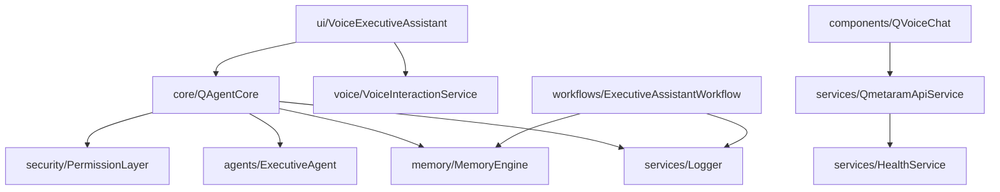

# Q.GALEXI Architecture Audit (2026-04-24)

## 1) Module Map (Current -> Target)

### Current high-level
- `src/pages`: large feature pages and route-level composition
- `src/components`: mixed UI primitives + feature modules + domain widgets
- `src/lib`: APIs, engines, utilities, domain logic
- `api/`: express backend + token/guardian/memory market services

### New productized modules added
- `src/core`: orchestration core (`QAgentCore`)
- `src/agents`: role-based agent execution (`ExecutiveAgent`)
- `src/voice`: speech capture abstraction (`VoiceInteractionService`)
- `src/memory`: short/long memory abstraction (`MemoryEngine`)
- `src/tools`: tool registry abstraction (`ToolRegistry`)
- `src/ui`: voice-first executive UI (`VoiceExecutiveAssistant`)
- `src/services`: API service + health + structured logger
- `src/security`: permission boundary (`PermissionLayer`)
- `src/workflows`: focused business workflow (`ExecutiveAssistantWorkflow`)
- `tests`: test strategy scaffold

## 2) Dependency Graph (logical)

## 3) Redundant / Overlapping Areas
- Duplicate backend entries: `api/server.ts`, `api/server.mjs`, `api/server.cjs`, plus `api-simple.js/.cjs`, `api-test.cjs`.
- Dual chat stacks: `components/SunCoreChat.tsx`, `components/SunCoreChatEnhanced.tsx`, `components/QVoiceChat.tsx`, and multiple chat overlays.
- API client logic duplicated between legacy `src/lib/qmetaramApi.ts` and new `src/services/QmetaramApiService.ts` (transitional state).

## 4) Potential Dead Code / Low-value Complexity
- Some star/galaxy feature modules are large and disconnected from primary product journey.
- `src/pages/CommandCenter.tsx` (629 lines) and other large modules increase maintenance risk.
- `src/components/ui/sidebar.tsx` (584 lines) is generic and heavy for current product scope.

## 5) Missing Abstractions (before refactor)
- No unified request router/classifier/permission executor.
- Memory behavior spread across localStorage helpers and ad-hoc calls.
- Voice input behavior embedded inside UI components.
- No consistent enterprise logger abstraction.

## 6) Security Findings
- No `.env.example` existed before; now added.
- External network actions lacked explicit approval boundary before; now guarded in `PermissionLayer` + `QAgentCore`.
- Local storage used extensively for operational states; requires data integrity policy and expiry strategy.
- Browser extension errors suppressed globally (useful UX, but can hide actionable runtime issues).

## 7) Performance Bottlenecks
- Largest files exceed maintainability threshold:
  - `src/pages/CommandCenter.tsx` (629)
  - `src/components/ui/sidebar.tsx` (584)
  - `src/components/solarsystem/SpaceshipHUD.tsx` (436)
- Bundles are large (`index` and `three` chunks ~950KB+ each before gzip in build output).
- Multiple real-time visual modules loaded in same app increase boot complexity.

## 8) Enterprise Readiness Status

### Implemented in this refactor pass
- Structured logging (`src/services/Logger.ts`)
- Unified orchestration (`src/core/QAgentCore.ts`)
- Permission boundary (`src/security/PermissionLayer.ts`)
- Memory engine (`src/memory/MemoryEngine.ts`)
- Service abstraction (`src/services/QmetaramApiService.ts`, `src/services/HealthService.ts`)
- Voice-first product journey (`/assistant` route)
- Test scaffolding (`src/test/qagentcore.test.ts`, `src/test/memoryEngine.test.ts`, `tests/README.md`)
- `.env.example`

### Still recommended
- Consolidate backend entry points into one runtime target.
- Gradually migrate legacy `src/lib/*` APIs into `src/services/*`.
- Split files above 400 lines by domain boundaries.
- Add server-side auth for sensitive actions and action-level audit logs.
- Add CI gates: typecheck + test + lint + build.

## 9) Product Focus Recommendation
Primary journey should be:
1. Capture voice/text command (`/assistant`)
2. Classify + permission check (`QAgentCore`)
3. Execute business/analysis intent (`ExecutiveAgent`)
4. Persist memory (`MemoryEngine`)
5. Return formatted executive response

All non-core experiential modules should be behind feature flags until they justify business ROI.

## 10) Backend Core Stabilization Sprint (2026-04-24)

### Implemented
- Formal contracts introduced under `src/contracts`:
  - `src/contracts/AgentContracts.ts`
  - `src/contracts/MemoryContracts.ts`
  - `src/contracts/SecurityContracts.ts`
  - `src/contracts/ToolContracts.ts`
  - `src/contracts/ServiceContracts.ts`
  - `src/contracts/MonitoringContracts.ts`
  - `src/contracts/RuntimeContracts.ts`
- One official runtime bootstrap created: `src/runtime/QRuntime.ts`
- Typed config validation created: `src/config/AppConfig.ts`
- Typed error system created: `src/errors/index.ts`
- Metrics and tracing introduced:
  - `src/monitoring/MetricsRegistry.ts`
  - `src/monitoring/Tracer.ts`
  - `src/monitoring/Observability.ts`
- Core services refactored to contract-first dependencies:
  - `src/core/QAgentCore.ts`
  - `src/security/PermissionLayer.ts`
  - `src/memory/MemoryEngine.ts`
  - `src/tools/ToolRegistry.ts`
  - `src/agents/ExecutiveAgent.ts`

### Test coverage added for real flows and failure cases
- `src/test/contracts.test.ts`
- `src/test/runtime.test.ts`
- `src/test/permissionLayer.test.ts`
- `src/test/qagentcore.test.ts` (permission failure path)

### Validation status
- `npm run test`: passing (contracts, runtime boot, permission flow, failure paths)
- `npm run build`: passing

### Remaining backend hardening backlog
- Move noisy security/event logs to lower verbosity in test mode.
- Add contract tests for service failures (network and timeout simulation) in API service layer.
- Add backend integration tests for API boundary (`api/server.ts`) with permission bridge.
